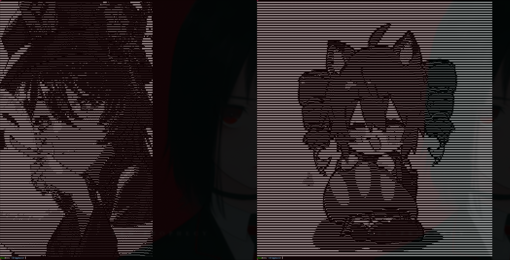
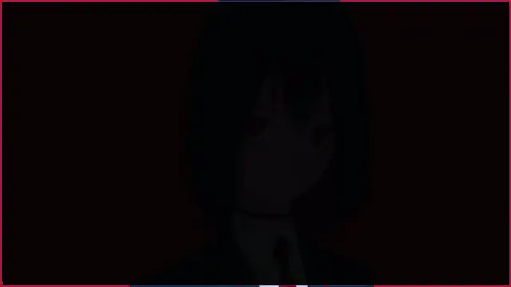

# Img2ASCII
Simple converter to ASCII using libav

## Examples



## Usage
```bash
./img2ascii test/2.jpg
```

## Dependencies
### libav
- libavformat
- libavcodec
- libavutil
### libsvscale

## Build
```bash
make
```


